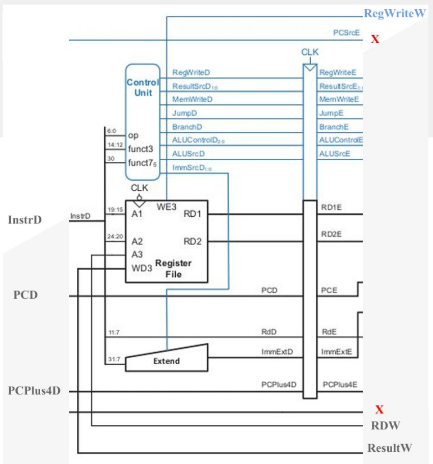
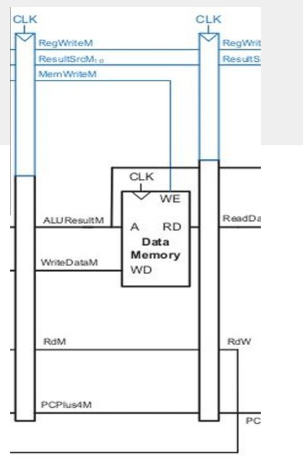
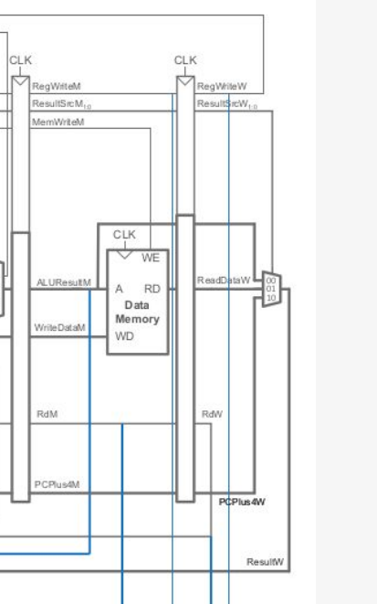
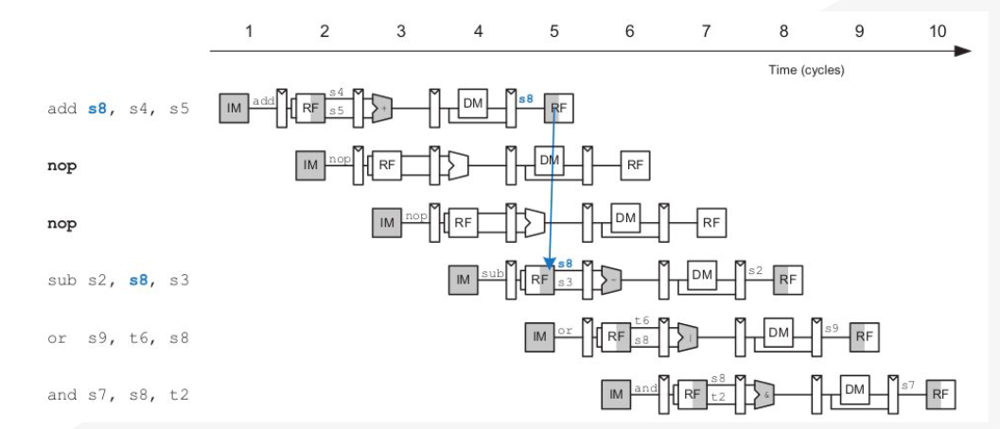
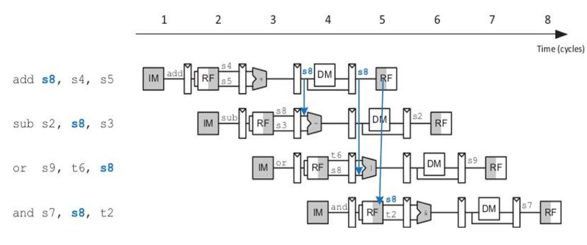
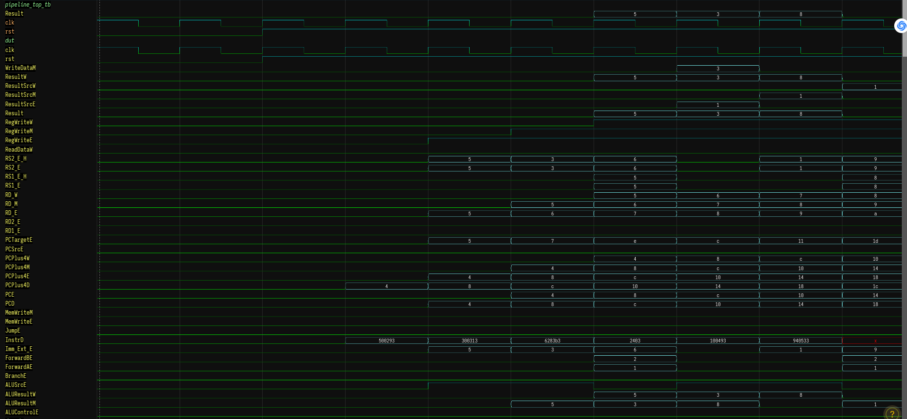

# RISC-V Pipeline Architecture

This project involves the design and implementation of a **RISC-V Pipelined Processor**. 
The pipeline architecture is subdivided into five stages, enabling simultaneous execution 
of five instructions, one in each stage, and achieving higher clock frequencies.

---

## Table of Contents

1. [Overview](#overview)
2. [Pipeline Stages](#pipeline-stages)
   - [Fetch Cycle](#fetch-cycle)
   - [Decode Cycle](#decode-cycle)
   - [Execute Cycle](#execute-cycle)
   - [Memory Cycle](#memory-cycle)
   - [Write Back Cycle](#write-back-cycle)
3. [Pipeline Hazards](#pipeline-hazards)
   - [Structural Hazards](#structural-hazards)
   - [Data Hazards](#data-hazards)
4. [Hazard Unit Implementation](#hazard-unit-implementation)
5. [Pipeline Top Architecture](#pipeline-top-architecture)

---

## Overview

We design a pipelined processor by subdividing the single-cycle processor into five pipeline stages. 
Thus, five instructions can execute simultaneously, one in each stage. Because each stage 
has only one-fifth of the entire logic, the clock frequency is approximately five times faster.

---

## Pipeline Stages

### Fetch Cycle

The Fetch Cycle Datapath consists of the following modules:
1. PC Mux
2. Program Counter
3. Adder
4. Instruction Memory
5. Fetch Stage Registers

[Fetch Cycle Datapath](./pic/Fetch_Cycle.png)

---

### Decode Cycle

The Decode Cycle Datapath consists of the following modules:
1. Control Unit
2. Register File
3. Extender
4. Decode Stage Registers

---

### Execute Cycle

The Execute Cycle Datapath consists of the following modules:
1. AND Gate
2. Mux
3. Adder
4. ALU
5. Execute Stage Registers

---

### Memory Cycle

The Memory Cycle Datapath consists of the following modules:
1. Data Memory
2. Memory Stage Registers

---

### Write Back Cycle

The Write Back Cycle Datapath includes:
1. Mux

---

## Pipeline Hazards

### Structural Hazards

Structural Hazards occur when the hardware does not support the execution of an instruction in the same clock cycle. For example:
- Without dual memory, the RISC-V pipelining architecture faces structural hazards.

### Data Hazards

Data Hazards occur when data to be executed is not available. Examples:
- Stalling the pipeline may occur.
- Solving techniques include:
  - Using NOPs
  - Forwarding/Bypassing

#### Using NOPs

#### Using Forwarding/Bypassing

---

## Hazard Unit Implementation

The Hazard Unit is implemented based on the following condition table:

| Stage           | Condition                                           | ForwardAE | ForwardBE |
|------------------|-----------------------------------------------------|-----------|-----------|
| Memory Stage    | RegWriteM and (RdM != 0) and (RdM == Rs1E)          | 10        |           |
| Write Back Stage| RegWriteW and (RdW != 0) and (RdW == Rs1E)          | 01        |           |

---

## Pipeline Top Architecture

---
### Observed Waveform

---
## Thank You

For further details, refer to the documentation or contact the author.
